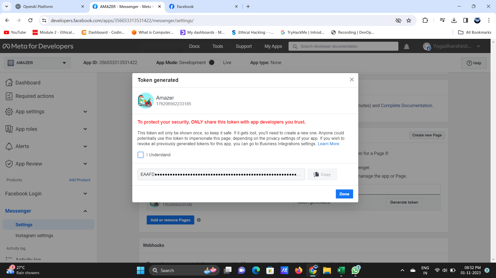

# IBM chatbot-with-watson

Watson was created as a question answering (QA) computing system that IBM built to apply advanced natural language processing, information retrieval, knowledge representation, automated reasoning, and machine learning technologies to the field of open domain question answering.

I will explained how to make chatbots using IBM and believe me it is just 30 minutes practice. No need to write extra code and all stuff of Deployment of Chatbot just give some intents and integrate it as preview link or facebook messenger and slack etc whatever you can use by IBM.

So Let's get started :
_______________
First Basic step we have to do is that we have to make a IBM Account on [Link](https://cloud.ibm.com/).
* In this you just finish the verfication and all stuff that is required.

Then go to IBM dashboard but let me know that you are only have permission of making one Watson Assistant not two or three. 

When you click on IBM Cloud you can see the dashboard there. And just as 

As we all know about the IBM, it is a huge platform of making not only chatbots but translators, discoveries, text to speech and vice versa etc.
In this we are gonna to make a simple chatbot by this you can have a idea of what and how watson work in actual or real-life.

In the navigation bar i.e three lines in the left of the dashboard page, click on that and then click on RESOURCES LIST. Here you can see the list of resoureces you have used and those you haven't use yet. We are gonna make a service name Watson Assistant. SO how will you approach that.
After clicking on Create Resourecs you will see a page like 

Just Click on Watson Assistant and you will see a create page. In this there are a lot of text inputs like region, plan, watson etc.
I prefer to choose 
* Region - London if you are from the country in the given list then choose that.
* Plan - LITE if you haven't a subscription of IBM.
* Service Name - You have write watson-assistant-__ then you can write either of a number or alphabet like c9, 5n etc.

And in this page you just choose the plan and leave all in their default positions.Click on **Create**. Okay we are going to launch Watson Assistant and make sure you are with me on this page :

And one more thing here is, if you want to use this watson assistant in outside code so there you can see the API key and URL of this just copy and paste wherever you want to use this assistant. This is a great opporunity which watson offer.
Here you can see two buttons :
* Launch Watson Assistant
* Getting Started Tutorial
If you are not comfortable with my instructions you will follow up the tutorial too. Here is the link of that : https://cloud.ibm.com/docs/services/assistant?topic=assistant-getting-started#getting-started-tutorial

SO, CLick on Launch Watson Assistant. A another window will appear like that :

You can see there is a default assistant here Yep it has a default assistant. Just go into it there you can see a skills just click on that.
Then you can many buttons on the nav bar.

There is :
* Intents
* Entities
* Dialog
* Options
* Content Catalog

Intents : It means like a user say hello but we know we can start with Hi, Hey, What's app, How arer you etc. these are some user examples which we can communicate with the bot we going to make. So put these in a single intent named as Hello-messages then add all the hello messages in it so that watson assistant can easily understand what the user is saying. 

Note : We have to add at least 5 user examples to an intent for the understanding of watson assistant.

Entities : It means a particular word like for example What is the weather today ? So here is Today is a entity that contain the today's tomorrow and something else. So extract the particular word from the user sentense that is entity I called. 

Dialog : When you message to bot like "Hello, What are you doing ?" So bot have to answer it like "Yep, I am waiting for you." That much so these are called dialog skills. In these we put a respone to user message here.

Note : You can add muliple responses in Watson Assistant. 

Options : It contains all options like importing webhooks and reponse options etc. we can edit it from here. It is just a editing part of our Assistant.

Content Catalog : This contains pre-made intents like greeting, ending, or bank etc. 
Just Click on this buttton and add to skills these intents. This made so easy for user.

Content Intent Page :::::::::

Hope you are getting a idea of how it is working. We can integrate it on Facebook, Slack etc.
BY this tutorial, I will explain how to do this.

Okay let's start something practical. 
Look at this page, make sure you are on this. if not then check you have launched your assistant or not.

Guys here you are seeing that there is two buttons one is create intent and another is upload csv file of intent to this assistant.
If you have pre-intent files then upload it by clicking on **Import Intents**.

Okay if you have not any intent just follow these steps:
* Create Intent Button Click on that.
* Give the name to intent (make sure it doesn't contain underscores, and other symboles i.e My-intent-name)
* Give the decription of intent but it is optional.
* Add the user examples like you have made a intent named Hello-messages then user examples should be like hi, hey, hello, what'sap, How are you and many more.
* Add on these user examples as you want.

Okay, Now you have added all the user examples. It's time to Bot answers to user. Create on dialog skill button then you have seeing two nodes there Welcome and Anything Else.
Welcome is that when you open chatbox then it will display a msg to user like "Welcome to my Serivice". And Anything else is that when you write anything that is not matched by the data you have added then it will show up a anything else message like "I didn't get your point" etc. 
If you wanna add your answer then click on the right side of Wecome node. You can see Three dots click on that and then click on Add Node Below then you fill your intent name staring with "#". Then write up your answer in the response text.
Click on X button it will save and train watson.

GO to **Try it Out** Button click on that and here you can see the welcome message you have put in the welcome node there.
Send a messaage and you can see the answer and the intent name in which the message belong to.

See ::::

Let's deploy it as a preview link first and then on slack and facebook etc.

Steps for deploying it into preview link is :
* Go to the Assistant Page.
* You can see the three dots there click on that and then Integration(0).

When you click on Integration you can see the page of integration that contains many integration methods like preview link, facebook, slack etc.
We are going to complete it by preview link.

And in the left-bottom corner you find the Integration. Then scroll-down, you find the Facebook messenger and Slack. Click add in the Facebook.

 
Now you will be directed to the integration steps follow it carefully.
You will need to create your Facebook page by using the Meta for Developers.
And the proceed with the given steps.

 This is the Facebook page we created.

Applicaton Secret is obtained :

 
 
Then the chat is then tested as a messenger to answer the queries.

 

Now for the Slack you need to choose the chatbot you created for it from the dashboard. And the opt for Slack from Integration. And you need to prepare you app by log in to slack and follow the steps are followed:
1.	From the Assistants page, click to open the assistant tile that you want to deploy.
2.	From the Integrations section, click Add integration.
3.	Click Slack.

4.	

5.	You need to have a Slack app to connect to.
If you don’t have a Slack app, create one now. See Starting with Slack apps.
6.	Go to the Your Apps page on the Slack website, and then click the app you want to use.
Open the Slack app in a new browser tab, so you can easily switch back and forth between the Slack app settings page and Watson Assistant Slack integration configuration page.

7. 

8.	From the settings page for your Slack app, open the App Home page.
9.	Add access scopes for your Slack app.
The button label might be Review Scopes to Add or Update scopes depending on whether you are creating a new app or editing an app that you created before February 2020.
The method for Slack access changed. For more information about it, read the Slack blog post about it.

10. 

11.	Assign bot token scopes to your Slack app. At a minimum, apply the following scopes:
•	app_mentions:read
•	chat:write
•	im:history
•	im:read
•	im:write

12. 

13.	Click Install App to Workspace, and then allow the installation when prompted.
If you are editing scopes for an existing application, reinstall it.
14.	From the Slack settings App Home page, enable the Always Show My Bot As Online setting.
15.	Go to the OAuth and Permissions page in Slack, copy the Bot User OAuth Access Token.
16.	From the Watson Assistant Slack integration configuration page, paste the token that you copied in the previous step into both the OAuth access token and Bot user OAuth access token fields.
17.	On the Slack app settings page, go to the Basic Information page, and then find the App Credentials section. Copy the app credential verification token.
18.	From the Watson Assistant Slack integration configuration page, paste the verification token that you copied in the previous step into the Verification token field.
19.	Click Generate request URL, and then copy the generated request URL.

20.	

21.	Return to the Slack app settings page. Open the Event Subscriptions page, and then turn on Enable Events. Paste the request URL that you copied in the previous step into the field.
22.	On the Event Subscriptions page in Slack, find the Subscribe to Bot Events section. Click Add Bot User Event, and then select the event types you want to subscribe to. You must select at least one of the following types:
•	message.im: Listens for message events that are posted in a direct message channel.
•	app_mention: Listens for only message events that mention your app or bot.

23. 

Choose the app_mention entry in normal font, not the app_mention entry that is in bold font.
24.	Click Save Changes.

25.	

26.	Optional: To add support for showing buttons, menus, and disambiguation options in the Slack app, go to the Interactive Components tab and enable the feature. Paste your request URL in the provided text entry field, and then click Enable Interactive Components.

27.	

28.	

29.	

Chatting with the assistant
To start a chat with the assistant, complete the following steps:
1.	Open Slack, and go to the workspace associated with your app.
2.	Click the application that you created from the Apps section.
3.	Chat with the assistant.

   
By this we have integrated the chatbot with Facebook and Slack. And the link for chatbot of the Facebook Messenger:
 https://www.facebook.com/profile.php?id=6155264713684
